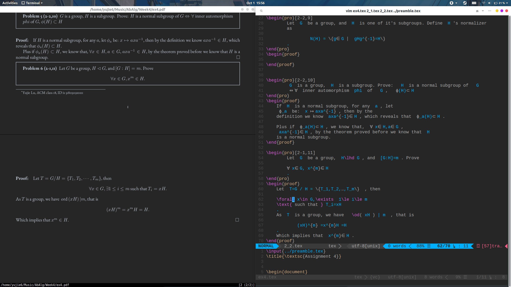

# HappyTexing
# A collection of tools to boost the speed of latex coding.

Attention: all of the configuration is under linux.

## 1. Speed Boost

### 1.1 Vimtex
`latexmk` is a great method to implement real time compiling. 
* `\ll` to compile with `latexmk`, then every time you save the tex files
the pdf will be automatically compiled. 
* `\lv` to view pdf.
* `:nn` to view all commands.

### 1.2 UltraSnippet

It's the core to speed up.

### 1.3 preamble.tex
This is a file to store macro and new command. 
Just add one line to your tex file

    \input{../preamble.tex}

## 2. Beautifing
### 2.1 Zathura
Configure zathura by
    
    vim ~/.config/zathura/zathurarc

### 2.2 beautify vim