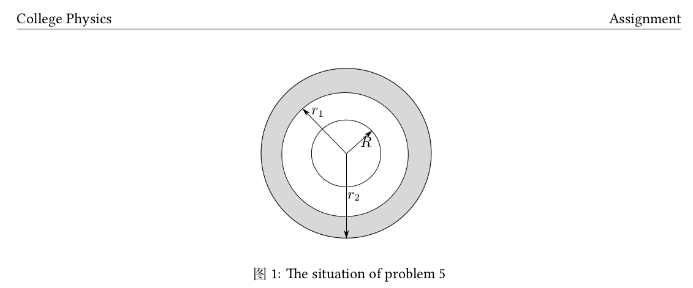

# HappyTexing
# 大幅加速latex编辑的工具集

* <a href="./README.md">English version</a>


所有的配置都只适用于 linux (我用的Ubuntu 19.04)，也许在macos下面也能用. 希望他们对你有所帮助
## 序言 
如果你比较懒的话，我写了一个脚本来实现自动安装和配置。不过最好还是看一看配置的原理方便日后使用。
```bash
git clone https://github.com/yujie6/HappyTexing.git
sudo bash install.sh
```

## 1. 加速工具

### 1.1 Vimtex
Vimtex 集成了 `latexmk`, 一个可以实时编译的tex工具（texlive自带）. 也就是说
只要你修改文件后进行了保存，latexmk会自动帮你编译并且将修改显示在pdf上
* `\ll` 后台运行 `latexmk`.
* `\lv` 查看 pdf，你可以在`.vimrc`中设置pdf查看器.
* `\le` 查看报错.
* `:nn` 查看所有相关的命令.


### 1.2 UltiSnips

这是提速的核心. 我强烈推荐安装这个vim插件来进行latex的编辑, 你可以查看 <a href="https://castel.dev/post/lecture-notes-1/">这个博客</a> 窥见他有多么的方便。

### 1.3 preamble.tex
这是一个保存自定义命令和宏的头文件.
每次我打开一个新的tex文件时，我只需添加一行便可以开始我的编辑了

    \input{../preamble.tex}

如果你在编辑中文, 最好使用 `\documentclass{ctexart}`. 并且你应该将 `xelatex`作为你的编译器。
为了能够在latexmk中使用`xelatex`, 只需添加  

    $pdflatex="xelatex %O %S";

到你的`$HOME/latexmkrc`.
## 2. 编辑环境美化
### 2.1 Zathura
Zathura 是一个轻量级的 pdf 查看器，他有着和vim差不多的快捷键. 
最爽的一点在于他是高度可定制化的. 你可以通过
    
    vim ~/.config/zathura/zathurarc

来配置zathura。比如我可以加两行来修改颜色

    set recolor-darkcolor  \#bfc7d5
    set recolor-lightcolor \#262626

这样当我使用`ctrl R` 进入夜间模式时，其背景颜色就和我的vim一样了，看起来就很舒服。

### 2.2 vim美化
这个我并没有花太多时间，网上也有很多教程。 我只修改了 colorscheme 以及安装了一个vim-airline. 这些全部是通过
vim-plug配置的（一个插件管理器）, 安装和更新都十分方便. 更多细节可以查看 `.vimrc` .
## 3 快速做图 （可选）
`inkscape` 是一个极为强大的开源作图软件，支持所有平台。最关键的是它支持输出
`.pdf_tex`，也就是说你可以在图里自由的加入公式。配合Gilles开发的快捷键工具，你可以很快的输出高质量图片。

但是这个软件需要一些学习成本，而且可能并不是每个人都需要作图，所以他的下载是可选的。
## 4. 致谢
非常感谢 <a href="https://github.com/gillescastel">Gilles Castel</a>的博客. 
我拜读了他的几篇博客感觉醍醐灌顶。这真的帮我省了很多时间。
