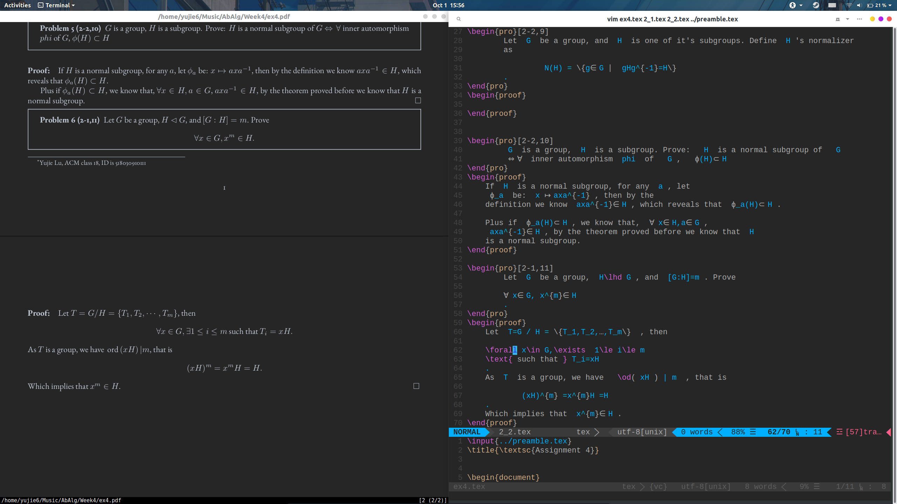

# HappyTexing
# A collection of tools to boost the speed of latex coding.

* <a href="./README_zh.md">中文版</a>



All of the configuration is under linux (Ubuntu 19.04). Hope they
are useful to you.

## Prologue
If you are lazy, I write a script to download and configured every thing. But it's still necessary to read through the rest of this readme and practice.

```bash
git clone https://github.com/yujie6/HappyTexing.git
sudo bash install.sh
```

## 1. Speed Boost

### 1.1 Vimtex
Vimtex integrate `latexmk`, which is a great tool to implement 
real time compiling. That means  then every time you save the tex files
the pdf will be automatically compiled. 
* `\ll` to compile with `latexmk`.
* `\lv` to view pdf.
* `\le` to view error messages.
* `:nn` to view all commands.


### 1.2 Ul­tiSnips

It's the core to speed up. I strongly recommend this vim plugin to write 
edit tex formulas, you can refer to <a href="https://castel.dev/post/lecture-notes-1/">this blog</a> to see 
how convenient it is.

### 1.3 preamble.tex
This is a file to store macro and new command. 
Just add one line to your tex file

    \input{../preamble.tex}

If you are editing Chinese, I suggest using `\documentclass{ctexart}`. Plus you should use `xelatex` as your compiler.
In order to use `xelatex` in latexmk, just add  

    $pdflatex="xelatex %O %S";

to `$HOME/latexmkrc`.
## 2. Beautifing
### 2.1 Zathura
Zathura is a light-weight pdf viewer with vim like shortcut. 
And it's highly configurable. You can configure zathura by
    
    vim ~/.config/zathura/zathurarc

You can use `Ctrl R` to change to night mode. I have added 2 lines to set the color

    set recolor-darkcolor  \#bfc7d5
    set recolor-lightcolor \#262626

in order to make the background the same with my vim.

### 2.2 beautify vim
I didn't pay much attention to this one. I just set the colorscheme and install vim-airline. All these are done with
vim-plug, which is really easy to use. You can check my `.vimrc` for details.

## 3. Acknowledge
Great thanks to <a href="https://github.com/gillescastel">Gilles Castel</a>. I refered to his blogs for most of my configuration. When it's done, it really saves a lot of time for me.
